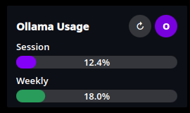

# Kol

Plasma 6 widget that tracks your Ollama Cloud token usage in real time. Shows session and weekly quota progress bars. Supports Firefox and Chromium cookies, auto-refresh, and FR/EN interface.



## Features

- **Session & Weekly quotas** — progress bars showing current usage percentage
- **Color-coded thresholds** — orange ≥80%, red ≥95%
- **Auto-refresh** — configurable interval (1–60 minutes)
- **Browser cookies** — reads cookies from Firefox and Chromium/Chrome/Brave/Vivaldi profiles
- **i18n** — native KDE translation system (follows system locale)
- **Config panel** — refresh interval and cookie override accessible from widget context menu

## Installation

```bash
# Requires plasma-workspace-devel for kpackagetool6
sudo dnf install plasma-workspace-devel   # Fedora
# or sudo apt install plasma-workspace-dev  # Debian/Ubuntu

cd Kol
bash install.sh
```

Then add **KOL Browser** to your panel from the widget explorer.

## Configuration

Right-click the widget → **Configure KOL Browser…**

- **Refresh interval** — minutes between automatic updates (default: 5)
- **Ollama cookie header** — manual cookie override for encrypted browser cookies

### Cookie override

If browser cookies can't be read (e.g. encrypted Chromium cookies via keyring), you can either:

1. Set the `OLLAMA_COOKIE_HEADER` environment variable:
   ```bash
   export OLLAMA_COOKIE_HEADER="session=your_cookie_value"
   ```

2. Or paste the cookie header directly in the widget config panel

## Dependencies

- KDE Plasma 6
- Python 3

## License

MIT © Vbxlab

## Links

- **KDE Store**: https://www.opendesktop.org/p/2362529/

---

*Vibecoded with [Aï](https://openclaw.ai)*
